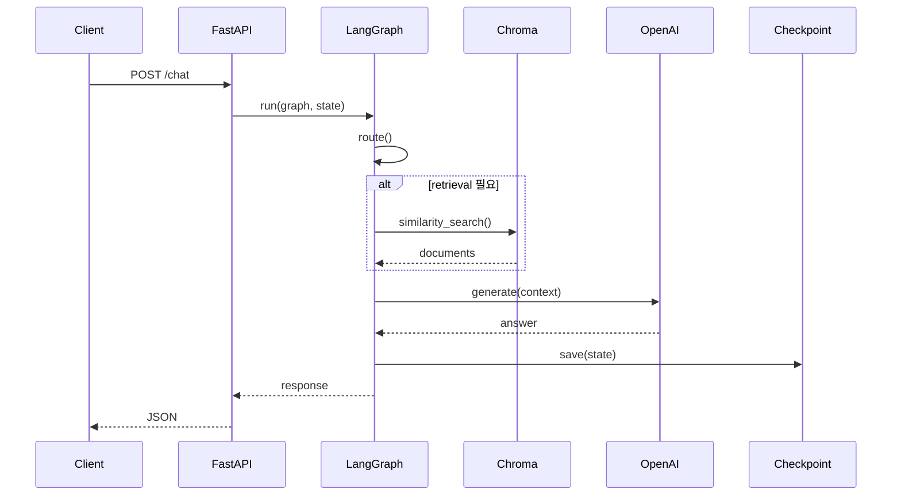
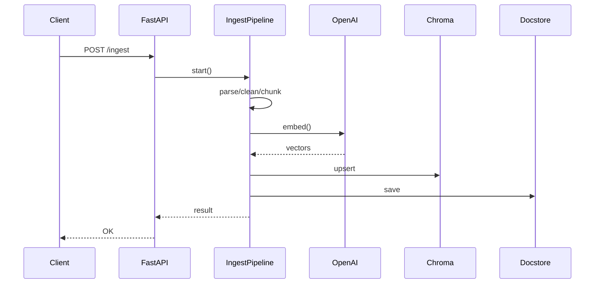

# 01Architecture.md — 개인용 AI 비서 RAG 시스템 아키텍처 v1.0

> 기준 문서: `00Info.md — 개인용 AI 비서 RAG 시스템 설계서 v1.0`

---

## 1. 문서 목적

본 문서는 개인용 AI 비서 RAG 시스템의 **전체 아키텍처 구조**를 정의한다.

구현 세부 사항은 `00Info.md` 설계서를 따르며, 본 문서는 다음 항목에 초점을 둔다.

* 시스템 구성 요소와 책임 분리
* 데이터 흐름
* 컴포넌트 간 경계
* 확장 가능 지점
* 비기능 요구사항(NFR)

---

## 2. 아키텍처 개요

### 2.1 설계 원칙

* 단일 사용자 환경에 최적화
* 서버 중심 구조 (Client는 thin client)
* Orchestration 계층과 비즈니스 로직 분리
* 로컬 환경 재현 가능성 중시
* 점진적 확장 가능 구조

### 2.2 전체 구조 다이어그램

```mermaid
flowchart LR
  CLI[CLI Client] -->|HTTP| API[FastAPI]
  WEB[Web Client (future)] -->|HTTP| API

  API --> LG[LangGraph Runtime]

  LG --> RT[route]
  LG --> RV[retrieve]
  LG --> GN[generate]
  LG --> FZ[finalize]

  RV --> CH[(Chroma Vector DB)]
  LG --> DS[(SQLite Docstore)]
  LG --> CP[(SQLite Checkpoint)]
  GN --> OAI[OpenAI API]
```

---

## 3. 레이어 구조

### 3.1 Client Layer

**구성**

* CLI Client (MVP)
* Web Client (향후)

**책임**

* 사용자 입력 수집
* 서버 응답 출력
* 상태 저장 없음

### 3.2 API Layer (FastAPI)

**책임**

* HTTP 요청 수신
* 요청 유효성 검증
* LangGraph 실행 호출
* 응답 포맷 통합
* 로깅

### 3.3 Orchestration Layer (LangGraph)

**책임**

* RAG 파이프라인 실행 제어
* 상태(State) 관리
* 분기/조건/노드 연결
* Checkpoint 저장

### 3.4 Retrieval Layer

**책임**

* 벡터 검색 수행
* metadata 포함 검색 결과 반환

### 3.5 Generation Layer

**책임**

* OpenAI LLM 호출
* 컨텍스트 기반 답변 생성
* 응답 포맷팅

### 3.6 Storage Layer

| 저장소               | 역할         |
| ----------------- | ---------- |
| Chroma            | 벡터 검색 인덱스  |
| SQLite Docstore   | 원문 + 메타데이터 |
| SQLite Checkpoint | 대화 상태 저장   |

---

## 4. 컴포넌트 책임 분리

| 컴포넌트       | 책임                     |
| ---------- | ---------------------- |
| CLI        | 입력/출력                  |
| FastAPI    | API Gateway            |
| LangGraph  | Workflow Orchestration |
| Retriever  | 검색                     |
| Generator  | 답변 생성                  |
| Chroma     | 벡터 인덱스                 |
| Docstore   | 원문 보관                  |
| Checkpoint | 상태 관리                  |

---

## 5. 데이터 흐름

### 5.1 질의응답 흐름



### 5.2 인제스트 흐름



---

## 6. 상태(State) 관리 구조

LangGraph State 기본 필드

* thread_id
* question
* retrieval_query
* docs
* answer
* attempt

Checkpoint DB에 JSON 형태로 저장된다.

---

## 7. 비기능 요구사항 (NFR)

### 7.1 성능

* top_k = 5
* chunk_size = 500~800 tokens
* context 길이 제한 적용

### 7.2 안정성

* LLM 실패 시 2회 재시도
* Vector DB 실패 시 graceful fallback
* ingest 실패 시 skip + 로그

### 7.3 재현성

* 모든 데이터는 `./data` 디렉토리에 저장
* 환경 변수 기반 경로 설정

---

## 8. 확장 포인트

* query rewrite 노드 추가
* rerank 노드 추가
* memory summary 노드 추가
* web UI 추가
* 다중 thread 관리 UI

---

## 9. 기술 결정 사항

| 항목            | 결정        |
| ------------- | --------- |
| LLM           | OpenAI    |
| Vector DB     | Chroma    |
| API Server    | FastAPI   |
| Orchestration | LangGraph |
| Docstore      | SQLite    |
| Checkpoint    | SQLite    |

---

## 10. 관련 문서

* `00Info.md` — 설계서
* `02ApiSpec.md` — API 명세 (예정)
* `03CliSpec.md` — CLI 명세 (예정)

---

작성자: 김해준
작성일: 2026-01-28
버전: v1.0
