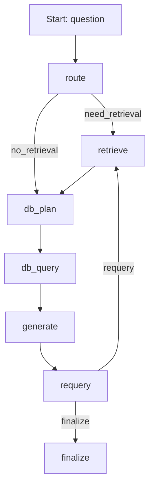

# 04GraphSpec.md — LangGraph 그래프 명세서 v1.1

> 기준 문서: `00Info.md`, `01Architecture.md`, `02ApiSpec.md`

---

## 1. 목적

본 문서는 LangGraph 기반 RAG 워크플로우의 **그래프 구조, 상태(State) 스키마, 노드(Node) 입출력, 분기 조건**을 명세한다.

설계 목표:

* 단순한 MVP 그래프 제공
* 상태 기반 실행의 재현성 확보
* 향후 노드 확장(Rewrite, Rerank, MemorySummary) 가능 구조 유지

---

## 2. 그래프 개요

### 2.1 노드 구성 (MVP)

| Node     | 책임                               |
| -------- | -------------------------------- |
| route    | 검색/DB 필요 여부 판단 및 retrieval_query 설정 |
| retrieve | Chroma 검색 수행 및 docs 채움           |
| db_plan  | 자연어 → QuerySpec 생성               |
| db_query | DB 어댑터 실행 및 db_result 채움          |
| generate | OpenAI 호출로 답변 생성                 |
| requery  | 근거 부족 시 재질의 쿼리 생성/재검색 유도 |
| finalize | 응답 포맷 정리 및 반환 데이터 구성             |

### 2.2 그래프 플로우

---

## 3. State 스키마

### 3.1 State 정의

State는 LangGraph 실행 전/중/후에 지속되는 단일 객체이며, Checkpoint에 저장된다.

| 필드               | 타입             | 필수 | 설명                  |
| ---------------- | -------------- | -- | ------------------- |
| thread_id        | str            | O  | 세션 식별자              |
| question         | str            | O  | 사용자 질문 원문           |
| retrieval_needed | bool           | X  | route 판단 결과         |
| retrieval_query  | str            | X  | 검색용 쿼리(기본=question) |
| docs             | list[Document] | X  | 검색 결과 문서 조각         |
| db_needed        | bool           | X  | DB 조회 필요 여부         |
| db_query_spec    | dict           | X  | QuerySpec(JSON)          |
| db_result        | dict           | X  | DB 결과(JSON)             |
| db_error         | ErrorInfo      | X  | DB 오류(옵션)              |
| answer           | str            | X  | 생성된 답변              |
| citations        | list[Citation] | X  | 출처 정보               |
| attempt          | int            | X  | 재시도 횟수 (default=0)  |
| requery_needed   | bool           | X  | 재질의 필요 여부          |
| timing           | dict           | X  | 성능 측정(옵션)           |
| tokens           | dict           | X  | 토큰 사용량(옵션)         |
| error            | ErrorInfo      | X  | 오류 정보(옵션)           |

### 3.2 Document 구조

| 필드       | 타입    | 설명                                                  |
| -------- | ----- | --------------------------------------------------- |
| chunk_id | str   | 내부 식별자                                              |
| content  | str   | 본문(또는 Docstore 조회용 key)                             |
| metadata | dict  | source_path, file_type, parent_id, created_at, tags |
| score    | float | 유사도 점수(옵션)                                          |
| rerank_score | float | 리랭킹 점수(옵션)                                      |

### 3.3 Citation 구조

| 필드          | 타입  | 설명           |
| ----------- | --- | ------------ |
| chunk_id    | str | 인용된 chunk    |
| source_path | str | 출처 경로        |
| parent_id   | str | 상위 문서 ID(옵션) |

### 3.4 ErrorInfo 구조

| 필드      | 타입  | 설명    |
| ------- | --- | ----- |
| code    | str | 에러 코드 |
| message | str | 메시지   |

---

## 4. 노드 명세

### 4.1 route

**목표**

* retrieval 필요 여부를 판단한다.
* retrieval_query를 설정한다.

**입력**

* thread_id
* question

**출력(State 변경)**

* retrieval_needed: bool
* retrieval_query: str
* attempt: int (기본 0)

**판단 규칙(MVP)**

* 다음 조건 중 하나라도 만족하면 retrieval_needed=true

  * 질문에 "문서", "설계", "프로젝트", "코드", "API" 등 내부 자료 참조 가능성이 높은 키워드 포함
  * 질문 길이가 짧고(예: <= 15자) 맥락 부족
  * 질문에 파일명/경로 패턴(`.md`, `.txt`, `/`, `\`)이 포함
* 그 외는 false (단, 질문이 비어있지 않으면 기본적으로 true로 처리)

**비고**

* 초기에는 규칙 기반으로 시작하고, 필요 시 LLM Router로 교체한다.

### 4.2 retrieve

**목표**

* Dense(Chroma) + Sparse(FTS5) 하이브리드 검색을 수행한다.
* 결과를 병합/중복 제거 후 docs를 채운다.

**입력**

* retrieval_query

**출력(State 변경)**

* docs: list[Document]

**검색 파라미터(MVP)**

* top_k = 5
* collection = documents
* sparse_top_k = 10
* parent_expand_enabled = true
* parent_expand_limit = 8
* reranker_mode=auto 또는 always일 경우:
  * 초기 검색은 max(top_k, rerank_top_k)
  * 임베딩 기반 재정렬 후 top_k만 유지
  * rerank_score 기록

**예외 처리**

* Vector DB 오류 시:

  * error.code = VECTOR_DB_ERROR
  * error.message 설정
  * docs는 빈 배열로 유지

### 4.3 generate

**목표**

* OpenAI LLM을 호출하여 답변을 생성한다.
* 근거(context/DB 결과)가 없으면 답변을 제한한다.

**입력**

* question
* docs (optional)
* db_result (optional)

**출력(State 변경)**

* answer: str
* citations: list[Citation]

**프롬프트 규칙(MVP)**

* system: 간결하고 사실 기반, 근거 없으면 모른다고 말한다.
* user: question
* context: docs의 content를 합쳐 제한 길이 내 제공

**출처(citations) 생성 규칙**

* 답변에서 사용한 docs를 citations에 포함
* citations는 chunk_id/source_path만 필수

**예외 처리**

* OpenAI 실패 시:

  * 최대 2회 재시도 (attempt 증가)
  * 실패 시 error.code = LLM_ERROR

### 4.4 requery

**목표**

* 근거 부족 시 재질의 쿼리를 생성한다.
* 재질의 횟수 제한을 준수한다.
* 문서/출처 수가 기준 미달인 경우에만 재질의를 수행한다.

**입력**

* question
* answer
* citations
* attempt

**출력(State 변경)**

* requery_needed: bool
* retrieval_query: str (재질의 쿼리)
* attempt: int (증가)

**재질의 조건(기본)**

* citations 개수 < `requery_min_citations`
* docs 개수 < `requery_min_docs`
* answer가 `no_context_message`일 경우

### 4.5 db_plan

**목표**

* 자연어 질문을 QuerySpec(JSON)으로 변환한다.

**입력**

* question

**출력(State 변경)**

* db_query_spec: dict
* db_error: ErrorInfo (optional)

**비고**

* 실패 시 기본 QuerySpec으로 대체하고 db_error 기록

### 4.6 db_query

**목표**

* 선택된 DB 어댑터로 QuerySpec을 실행한다.

**입력**

* db_query_spec

**출력(State 변경)**

* db_result: dict
* db_error: ErrorInfo (optional)

### 4.4 finalize

**목표**

* API 응답 포맷(02ApiSpec)을 구성한다.

**입력**

* answer
* citations
* error (optional)

**출력**

* FastAPI Response payload

**응답 구성 규칙**

* error가 있으면 success=false
* error 없으면 success=true

---

## 5. 체크포인트(Checkpoint) 저장 정책

* `/chat` 요청마다 그래프 실행 종료 후 State를 저장한다.
* 저장 키는 thread_id 기반
* 저장 데이터는 State 전체(JSON)

---

## 6. 로그 및 측정(옵션)

State.timing에 다음 항목을 기록할 수 있다.

| 항목            | 설명             |
| ------------- | -------------- |
| t_route_ms    | route 실행 시간    |
| t_retrieve_ms | retrieve 실행 시간 |
| t_generate_ms | generate 실행 시간 |
| t_total_ms    | 총 실행 시간        |
| t_finalize_ms | finalize 실행 시간 |

---

## 7. 향후 확장 노드 (v1.1+)

| Node           | 목적                |
| -------------- | ----------------- |
| rewrite        | 질문 → 검색 최적화 쿼리 생성 |
| rerank         | 검색 결과 재정렬         |
| memory_summary | 대화 요약 저장          |
| validate       | 근거 부족/환각 검증       |

---

작성자: 김해준
작성일: 2026-01-29
버전: v1.1
