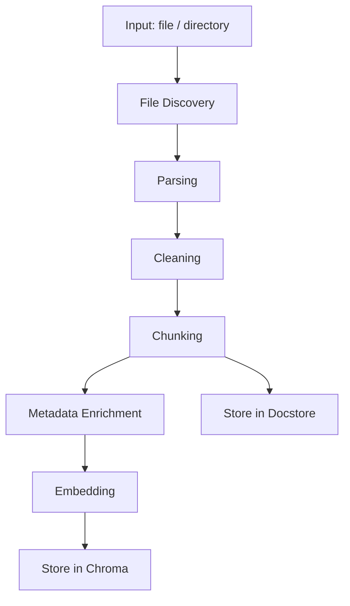

# 05IngestionSpec.md — 문서 인제스트 파이프라인 명세서 v1.2

> 기준 문서: `00Info.md`, `01Architecture.md`, `02ApiSpec.md`, `04GraphSpec.md`

---

## 1. 목적

본 문서는 개인용 AI 비서 RAG 시스템에서 사용하는 **문서 수집(Ingestion) 파이프라인의 구조, 단계, 데이터 변환 규칙, 저장 정책**을 명세한다.

목표:

* 다양한 문서를 RAG에 적합한 형태로 표준화
* Chroma(Vector DB) 및 Docstore(SQLite)에 일관성 있게 저장
* 재현 가능하고 오류에 강한 파이프라인 제공

---

## 2. 전체 파이프라인 개요



---

## 3. 입력(Input)

### 3.1 입력 유형

* 단일 파일
* 디렉토리 경로

### 3.2 지원 파일 형식 (v1.2)

| 확장자   | 유형       |
| ----- | -------- |
| .txt  | 일반 텍스트   |
| .md   | Markdown |
| .pdf  | PDF 문서   |
| .docx | Word 문서  |
| .png  | 이미지(OCR 대상) |
| .jpg  | 이미지(OCR 대상) |
| .jpeg | 이미지(OCR 대상) |
| .webp | 이미지(OCR 대상) |
| .bmp  | 이미지(OCR 대상) |
| .tif  | 이미지(OCR 대상) |
| .tiff | 이미지(OCR 대상) |

### 3.3 경로 정책

* 절대/상대 경로 모두 허용
* 화이트리스트 디렉토리 지정 가능 (`./docs`, `./data/input` 등)
* 시스템 경로 접근 제한 권장

---

## 4. 단계별 처리 규칙

### 4.1 File Discovery

* recursive 옵션 지원
* 숨김 파일 무시
* 중복 파일은 해시 기준으로 판단 (동일 내용만 skip)

### 4.2 Parsing

| 파일   | 라이브러리                 |
| ---- | --------------------- |
| txt  | 기본 파일 읽기              |
| md   | markdown parser       |
| pdf  | pdfplumber 또는 PyMuPDF |
| docx | python-docx           |
| 이미지 | PyMuPDF 렌더링 + OCR    |

출력: raw text

### 4.2.1 OCR (이미지/PDF 스캔 대응)

조건:

* PDF 텍스트 추출 결과가 매우 짧거나 비어 있을 때
* 이미지 파일 인제스트 시
* `OCR_ENABLED=true` 인 경우에만 동작

처리:

* PyMuPDF로 페이지/이미지 렌더링 → Tesseract OCR로 텍스트 추출
* 언어/해상도/페이지 수는 환경 변수로 제어

권장 환경 변수:

```
OCR_ENABLED=true|false
OCR_LANG=kor+eng
OCR_DPI=300
OCR_MAX_PAGES=5
OCR_MIN_TEXT_LEN=50
```

### 4.3 Cleaning

처리 규칙:

* 개행 정규화(\r\n → \n)
* 탭 → 공백
* 연속 공백 정리
* 3줄 이상 연속 개행은 2줄로 축약
* 불필요한 헤더/푸터 제거
* 페이지 번호 제거
* 특수문자 정규화

### 4.4 Chunking

기준:

* chunk_size: 500~800 tokens
* overlap: 100 tokens
* 문단 우선 분리
* 코드 블록 단위 유지
* 구현: 토큰 기준 청킹 (tiktoken, embedding_model 기준)

출력:

* chunk list

### 4.5 Metadata Enrichment

기본 메타데이터:

| 필드          | 설명            |
| ----------- | ------------- |
| chunk_id    | UUID          |
| parent_id   | 문서 UUID       |
| source_path | 원본 파일 경로      |
| file_type   | 파일 유형         |
| created_at  | 수집 시간         |
| tags        | 사용자 지정 태그(옵션) |
| hash        | 문서 내용 해시(중복 체크) |

### 4.6 Embedding

* OpenAI Embedding API 사용
* batch 처리
* 실패 시 재시도 2회

### 4.7 Vector Storage (Chroma)

저장 데이터:

* id: chunk_id
* embedding vector
* metadata

collection: documents

### 4.8 Docstore Storage (SQLite)

테이블: documents, ingest_files

저장 필드:

* chunk_id
* parent_id
* content
* source_path
* file_type
* created_at

ingest_files 저장 필드:

* source_path (PK)
* content_hash
* updated_at

### 4.9 Sparse 인덱스 저장(FTS5)

목적: Sparse 검색(BM25)을 위한 텍스트 인덱스 저장

테이블: `documents_fts` (SQLite FTS5)

저장 필드:

* chunk_id
* parent_id
* source_path
* file_type
* content

---

## 5. 중복 처리 정책

* 동일 source_path + 동일 hash(content) 존재 시 skip
* 내용 변경 감지 시:
  * 기존 documents 삭제 (source_path 기준)
  * Chroma 벡터 삭제 (source_path 메타데이터 기준)
  * 새 청크/벡터 재저장
* chunk 단위 중복 허용하지 않음

---

## 6. 오류 처리 정책

| 단계           | 처리 방식           |
| ------------ | --------------- |
| Parsing 실패   | 해당 파일 skip + 로그 |
| Cleaning 실패  | 원문 사용           |
| Chunking 실패  | 파일 skip         |
| Embedding 실패 | 2회 재시도 후 skip   |
| Storage 실패   | 롤백 + 로그         |

---

## 7. 성능 고려 사항

* embedding batch size 조절 가능
* 대용량 문서 처리 시 진행 로그 출력
* 병렬 처리 옵션 (v1.1+)

---

## 8. API 연계

본 파이프라인은 다음 API를 통해 호출된다:

* POST /ingest (02ApiSpec.md)

입력 path를 기반으로 실행된다.

---

## 9. CLI 연계

다음 명령어를 통해 호출된다:

```
assistant ingest <path>
```

옵션:

* --recursive
* --dry-run

---

## 10. 로그 정책

로그 파일 위치:

```
./logs/ingest.log
```

기록 항목:

* 파일 경로
* 처리 단계
* 소요 시간
* 오류 메시지

---

## 11. 확장 계획 (v1.3+)

* HTML 파서 추가
* 이미지 OCR 처리
* 사용자 태그 자동 분류
* 문서 중요도 점수 계산

---

작성자: 김해준
작성일: 2026-02-03
버전: v1.2
