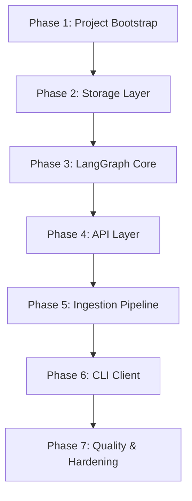

# 06WorkPlan.md — 개발 작업 순서 및 진행 전략 v1.0

> 기준 문서: `00Info.md`, `01Architecture.md`, `02ApiSpec.md`, `03CliSpec.md`, `04GraphSpec.md`, `05IngestionSpec.md`
>
> 개발 방식: Codex CLI 기반 개발 + `.ask/askXX.md` 작업 기록

---

## 1. 문서 목적

본 문서는 개인용 AI 비서 RAG 시스템을 구현하기 위한 **표준 개발 작업 순서(Implementation Order)** 와 각 단계의 목표 및 산출물을 정의한다.

목표:

* 개발 중 방향성 혼란 방지
* Codex CLI 작업 단위 명확화
* 중단/재개 시 빠른 컨텍스트 복구
* 설계 문서와 구현 간 일관성 유지

---

## 3. 전체 개발 단계 개요



---

## 4. Phase 1 — 프로젝트 초기화

### 목표

* 실행 가능한 FastAPI 서버 확보
* 기본 디렉토리 구조 생성

### 작업 항목

1. 프로젝트 디렉토리 생성
2. Python venv 생성
3. requirements.txt 작성
4. FastAPI main.py 생성
5. /health API 구현
6. config.py 작성 (.env 로딩 포함)

### 산출물

* app/main.py
* app/config.py
* requirements.txt
* .env

---

## 5. Phase 2 — Storage Layer 구현

### 목표

* Chroma Vector DB 사용 가능 상태
* SQLite Docstore / Checkpoint 동작

### 작업 항목

1. Chroma 초기화 모듈 작성
2. collection 생성
3. SQLite Docstore 스키마 생성
4. SQLite Checkpoint 스키마 생성
5. storage wrapper 클래스 작성

### 산출물

* app/storage/vector_db.py
* app/storage/docstore.py
* app/storage/checkpoint.py

---

## 6. Phase 3 — LangGraph Core 구현

### 목표

* MVP 그래프 실행 가능 상태

### 작업 항목

1. State 스키마 정의
2. route 노드 구현
3. retrieve 노드 구현
4. generate 노드 구현
5. finalize 노드 구현
6. graph.py 연결
7. checkpoint 연동

### 산출물

* app/graph.py
* app/nodes/route.py
* app/nodes/retrieve.py
* app/nodes/generate.py
* app/nodes/finalize.py

---

## 7. Phase 4 — API Layer 구현

### 목표

* API 명세(02ApiSpec.md) 충족

### 작업 항목

1. POST /chat
2. POST /ingest (임시 stub 가능)
3. GET /threads
4. POST /threads/reset
5. 공통 응답 포맷 적용
6. 에러 핸들러

### 산출물

* app/routes/chat.py
* app/routes/ingest.py
* app/routes/threads.py

---

## 8. Phase 5 — Ingestion Pipeline 구현

### 목표

* 실제 문서 등록 가능 상태

### 작업 항목

1. File discovery
2. Parser 구현
3. Cleaning 로직
4. Chunking 로직
5. Metadata 생성
6. Embedding 호출
7. Chroma 저장
8. Docstore 저장

### 산출물

* app/ingest/ingest.py
* app/ingest/loaders.py
* app/ingest/chunking.py

---

## 9. Phase 6 — CLI Client 구현

### 목표

* CLI 명세(03CliSpec.md) 충족

### 작업 항목

1. CLI entrypoint
2. chat 명령어
3. ingest 명령어
4. threads 명령어
5. reset 명령어
6. stats 명령어
7. config 명령어

### 산출물

* cli/assistant.py

---

## 10. Phase 7 — 품질 및 안정화

### 목표

* 실제 장기간 사용 가능 상태

### 작업 항목

1. 로깅 시스템
2. 토큰 사용량 기록
3. 성능 측정(timing)
4. 오류 메시지 정제
5. 설정 문서 정리

---

## 11. Codex CLI 작업 지침

각 Phase 시작 시 Codex에게 다음 컨텍스트 제공:

```
이 프로젝트는 다음 문서들을 기준으로 개발한다:
00Info.md
01Architecture.md
02ApiSpec.md
03CliSpec.md
04GraphSpec.md
05IngestionSpec.md
06WorkPlan.md

현재 Phase: <Phase 번호>
현재 작업: <작업 항목>
```

---

## 12. 변경 정책

* 작업 순서 변경 시 본 문서 수정
* Phase 병합/분리 시 버전 업데이트

---

작성자: 김해준
작성일: 2026-01-28
버전: v1.0
