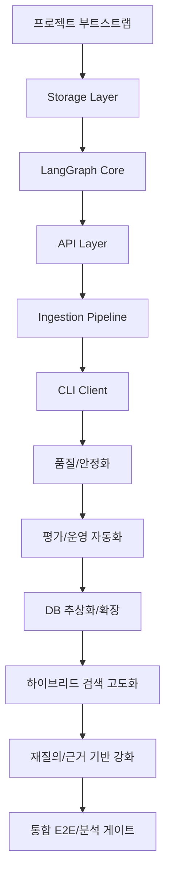
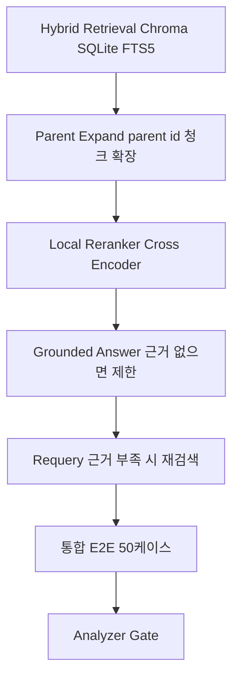

# 12WorkFlowTimeline.md — 작업 진행 흐름 다이어그램 v1.0

> 목적: ProjectRAG의 시작부터 현재까지 진행된 작업 흐름을 다이어그램 형태로 정리한다.
> 기준: .context 문서 및 .ask 작업일지 누적 기록
> 작성일: 2026-02-04

---

## 1. 전체 흐름 다이어그램(요약)

---

## 2. 단계별 주요 작업 흐름(상세)

### 2.1 단계별 세부 작업 포인트

- Bootstrap: FastAPI 서버/health, 설정 로딩, requirements 정리
- Storage: Chroma 컬렉션 생성, Docstore/Checkpoint 스키마 구축
- Graph: State 정의, route/retrieve/generate/finalize 구성, timing/tokens 기록
- API: chat/ingest/threads/reset 엔드포인트 구현
- Ingest: 탐색/파싱/클리닝/토큰 청킹, OCR, 중복 스킵 정책
- Client: CLI 명령어 세트, Web UI MVP
- Quality: reranker auto, 로깅/메트릭
- Eval: E2E eval, batch runner, soak runner, analyzer gate
- DB: QuerySpec/QueryResult, db_plan/db_query, MySQL adapter
- RAG+: Hybrid(Chroma+FTS5), Parent Expand, Local Reranker, Grounded Answer, Re-query

### 2.2 Phase별 미세 단계 + 산출물

```mermaid
flowchart TD
  subgraph Phase1[Phase1 Bootstrap]
    P1A[프로젝트 구조 생성]
    P1B[requirements.txt 작성]
    P1C[config/.env 로딩]
    P1D[FastAPI /health 구현]
    P1E[산출물 app main py and app config py]
  end

  subgraph Phase2[Phase2 Storage]
    P2A[Chroma 초기화/collection]
    P2B[Docstore 스키마]
    P2C[Checkpoint 스키마]
    P2D[산출물 storage vector db py docstore py checkpoint py]
  end

  subgraph Phase3[Phase3 LangGraph]
    P3A[State 스키마 정의]
    P3B[route/retrieve/generate/finalize]
    P3C[checkpoint 연동]
    P3D[타이밍/토큰 기록]
    P3E[산출물 app graph py app nodes]
  end

  subgraph Phase4[Phase4 API]
    P4A[chat endpoint]
    P4B[ingest endpoint]
    P4C[threads list reset]
    P4D[공통 응답 포맷]
    P4E[산출물 app routes]
  end

  subgraph Phase5[Phase5 Ingestion]
    P5A[discovery/parse/clean]
    P5B[token chunking]
    P5C[OCR 지원]
    P5D[중복 스킵/재저장]
    P5E[산출물 app ingest]
  end

  subgraph Phase6[Phase6 Client]
    P6A[CLI commands]
    P6B[Web UI /web]
    P6C[산출물 cli assistant py routes web py]
  end

  subgraph Phase7[Phase7 Quality]
    P7A[reranker auto]
    P7B[logging/metrics]
    P7C[산출물 logging utils py nodes]
  end

  subgraph Phase8[Phase8 Eval Ops]
    P8A[E2E eval 스크립트]
    P8B[batch runner]
    P8C[soak runner]
    P8D[analyzer/alerts]
    P8E[산출물 scripts e2e]
  end

  subgraph Phase9[Phase9 DB 확장]
    P9A[QuerySpec/QueryResult]
    P9B[db_plan/db_query]
    P9C[MySQL adapter]
    P9D[산출물 app db]
  end

  subgraph Phase10[Phase10 RAG 고도화]
    P10A[Hybrid Retrieval]
    P10B[Parent Expand]
    P10C[Local Cross-Encoder]
    P10D[Grounded Answer]
    P10E[Re-query]
    P10F[산출물 retrieve requery generate]
  end

  Phase1 --> Phase2 --> Phase3 --> Phase4 --> Phase5 --> Phase6 --> Phase7 --> Phase8 --> Phase9 --> Phase10
```

---

## 3. 최근 품질 고도화 흐름(상세)

---

작성자: 김해준
버전: v1.0
